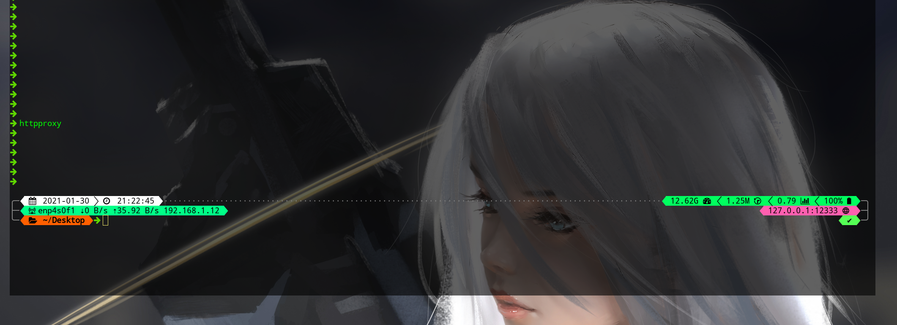
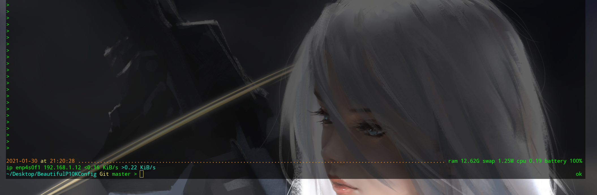

# 1 效果图

- `GUI`下：

- `tty`下

# 2 使用

脚本在`script`文件夹下:

- `p10kgui.zsh`是在`GUI`下使用的，256色+`Unicode`字符，非常的绚丽
- `p10ktty.zsh`是在`tty`下使用的，8色+`ASCII`字符

使用时将上面的**其中一个配置文件重命名为`.p10k.zsh`并放置到用户目录下**即可。

注意并不一定就是图片上的效果，因为与终端本身的颜色配置有关，请修改终端本身的颜色配置，比如笔者的是`xfce4`自带的终端，配置如下：

另外为了方便提供了一张官方的颜色表图片（`images/color.png`），如果需要自定义颜色可以参考。

# 3 一些可能有帮助的网站

- [图标库](https://www.nerdfonts.com/cheat-sheet)
- [p9k文档](https://github.com/Powerlevel9k/powerlevel9k/wiki)
- [p10k文档](https://github.com/romkatv/powerlevel10k)

# 4 参考博客

[CSDN](https://blog.csdn.net/qq_27525611/article/details/109260917)
